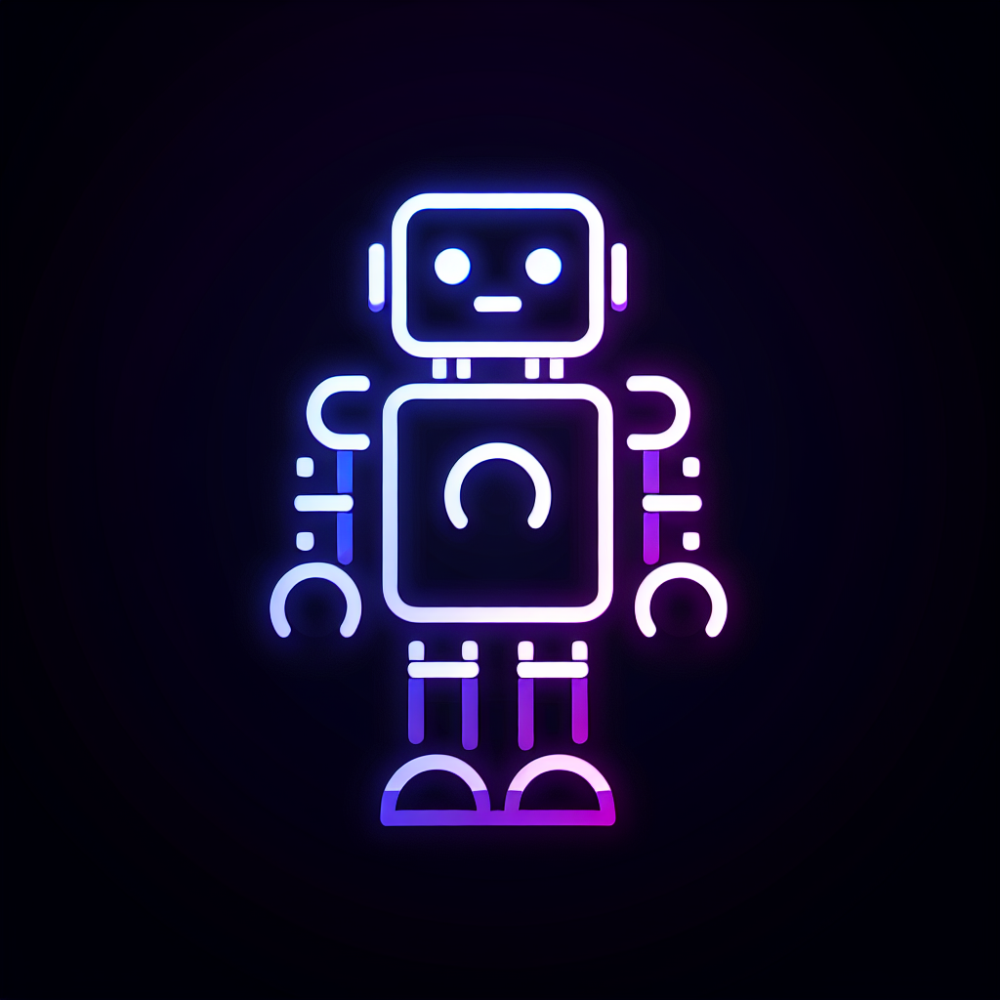

# 🎮 GameMode - Level Up Your Productivity

Turn your tasks into an RPG adventure! GameMode is a gamified productivity app that makes task management fun and rewarding.

## ✨ Features

- 🎯 **Task Management**: Transform your to-dos into quests
- ⚔️ **Level System**: Gain XP and level up by completing tasks
- 🔥 **Focus Mode**: Boost productivity with Pomodoro-style focus sessions
- 🏆 **Achievements**: Unlock special rewards as you progress
- 📊 **Progress Tracking**: Monitor your productivity journey
- 🌙 **Dark/Light Mode**: Choose your preferred theme

## 🚀 Getting Started

1. Clone this Repl
2. Run `npm install` to install dependencies
3. Start the development server with `npm run dev`
4. Visit your Repl's URL to start your productivity journey!

## 🛠️ Tech Stack

- **Frontend**: React + TypeScript + Tailwind CSS
- **Backend**: Express.js
- **Database**: PostgreSQL with Drizzle ORM
- **Authentication**: Passport.js
- **State Management**: React Context + React Query

## 🎮 How to Play

1. **Create an Account**: Start your journey
2. **Add Tasks**: Convert your real-world tasks into in-game quests
3. **Complete Tasks**: Earn XP and level up
4. **Focus Mode**: Use timed focus sessions for extra XP
5. **Track Progress**: Watch your character grow stronger

## 🏅 Achievement System

Level up to unlock special features:
- Level 2: Focus Mode Duration Options
- Level 3: Daily Challenge Feature
- Level 4: Task Categories
- Level 5: Custom Badges
- Beyond Level 5: Special Powers

## 💫 Features Coming Soon

- 🌟 Daily Streaks Rewards
- 🤝 Multiplayer Challenges
- 🎨 Custom Character Creation
- 📱 Mobile App Support

## 🤝 Contributing

Feel free to fork this Repl and contribute to make GameMode even better!
